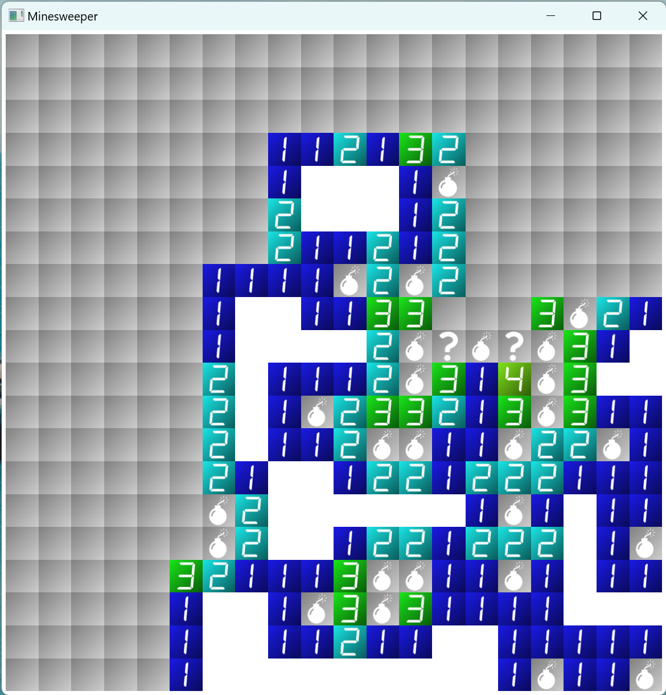

# Minesweeper

The game to opening cells avoiding bombs!  
Width, Height, Bombs count, and seed value can be set.  

  

## How to operate

Left click (Tap): Open cell (if the cell has no cell marker)  
Right click (Hold): Switch cell marker  

## Go package providers

- [fyne-io/fyne](https://fyne.io/) ([BSD 3-Clause License](https://github.com/fyne-io/fyne/blob/master/LICENSE))
- [hajimehoshi/ebiten](https://ebitengine.org/) ([Apache License 2.0](https://www.apache.org/licenses/LICENSE-2.0))

## Material providers

- [ICOOON MONO](https://icooon-mono.com/) ([Licence](https://icooon-mono.com/license/))
- [Font "DSEG" by Keshikan](https://www.keshikan.net/fonts.html) ([SIL Open Font Licence 1.1](http://scripts.sil.org/OFL))
- [OtoLogic](https://otologic.jp/) ([CC BY 4.0](https://otologic.jp/free/license.html))
